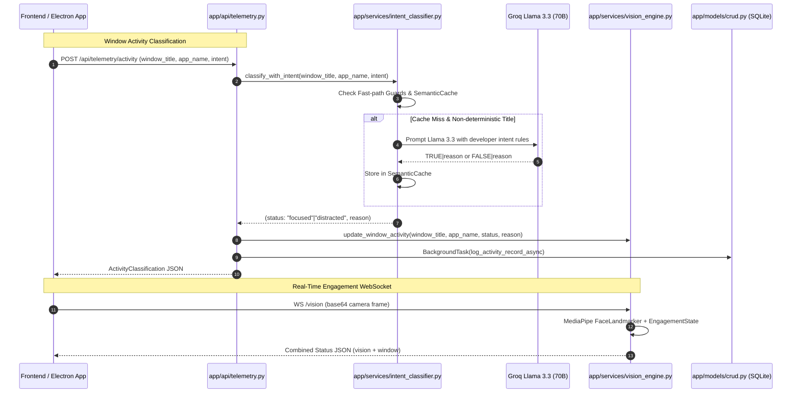

# Prodify Backend Architecture (Modular Service Architecture)

This document outlines the architectural principles, directory layout, separation of concerns, and end-to-end data flow for the Prodify backend.

---

## 🏛️ Directory Structure

```
backend/
├── app/
│   ├── models/            # Data Access & ORM Layer
│   │   ├── schemas.py     # SQLAlchemy declarative models (User, Workspace, Session, TelemetryLog, ActivityLog)
│   │   ├── connection.py  # DB Engine, SessionLocal, and table creation
│   │   └── crud.py        # Synchronous and background async CRUD operations
│   │
│   ├── services/          # Core Business Logic & Intelligence ("The Brain")
│   │   ├── vision_engine.py      # Developer-Intent posture & FaceLandmarker engagement machine
│   │   ├── star_ml.py            # Star ML Engine agentic tool-calling & persistent memory
│   │   └── intent_classifier.py  # Llama 3.3 semantic window evaluator & TTL cache
│   │
│   └── api/               # Thin HTTP Route Controllers
│       ├── ai_coach.py    # /api/chat and /api/function-call routes
│       └── telemetry.py   # /api/telemetry/* analytics & activity routes
│
├── data/                  # Persistent Runtime Data (Git-ignored / local storage)
│   ├── prodify.db         # SQLite relational database
│   ├── user_profile.json  # Long-term AI Coach memory
│   └── models/            # MediaPipe TFLite and Task assets
│
└── main.py                # Application Bootstrapper & WebSocket Gateway
```

---

## 🧠 Architectural Roles & Responsibilities

### 1. `app/api/` — Thin HTTP Controllers
**Why have an `api/` folder?**
API routers are strictly responsible for:
- Request serialization/deserialization via Pydantic models.
- HTTP request/response formatting and status code handling.
- Input validation and dependency injection (such as database sessions via `Depends(get_db)`).
- Dispatching requests to service layer abstractions and returning formatted results.

API controllers should **not** contain heavy computational logic, machine learning pipelines, prompt engineering strings, or direct database query loops.

### 2. `app/services/` — Core Intelligence ("The Brain")
**Why is `services/` the "Brain"?**
The `services/` directory encapsulates all domain logic, machine learning models, external LLM integrations, and state machines:
- **`vision_engine.py`**: Runs the 478-landmark MediaPipe Face Landmarker and implements the `EngagementState` machine. It distinguishes between actual distractions (face absent, eyes shut, stranger detected) and deep productive posture (head down / writing).
- **`star_ml.py`**: Houses the agentic tool-calling loops for the AI Coach (`get_focus_metrics`, `get_top_distractions`, `get_session_history`), dynamic prompt building, and persistent disk-backed memory (`user_profile.json`).
- **`intent_classifier.py`**: Manages window activity evaluation. It first screens against fast-path whitelists and IDE signatures, then invokes Llama 3.3 70B for semantic intent checking, caching results in a thread-safe `SemanticCache` (TTL 300s).

### 3. `app/models/` — Data Access & ORM
The models layer isolates database interaction:
- **`schemas.py`**: Defines the relational entities (`User`, `Workspace`, `Session`, `TelemetryLog`, `ActivityLog`).
- **`connection.py`**: Configures SQLite (`data/prodify.db`) with thread-safe connection pooling.
- **`crud.py`**: Centralizes query primitives and provides non-blocking background task functions (`log_activity_record_async`) to prevent database write latency from blocking HTTP requests.

---

## 🔄 End-to-End Data Flow (`Frontend` → `API` → `Services`)



### Flow Walkthrough
1. **Frontend / Desktop Shell**:
   The Electron frontend continuously captures the active window title and user camera feed.
2. **API Router Layer (`app/api/`)**:
   - HTTP requests land on `/api/telemetry/activity` or `/api/chat`.
   - The route validates Pydantic schemas and immediately invokes the appropriate service.
3. **Service Execution (`app/services/`)**:
   - `intent_classifier.py` checks the semantic cache. If a new window is detected, it queries Groq Llama 3.3 and caches the verdict.
   - `star_ml.py` executes agentic tool queries (`get_focus_metrics`, etc.) against `app.models.crud`.
   - `vision_engine.py` processes frames and combines posture classification with window activity status.
4. **Persistence (`app/models/` & `data/`)**:
   - Results are committed to `data/prodify.db` either synchronously (for critical state) or asynchronously via FastAPI background tasks.